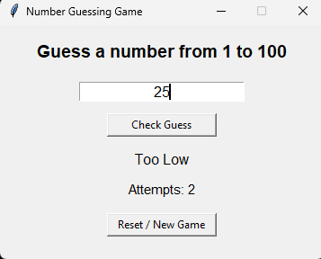
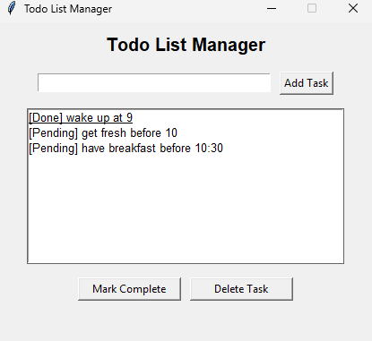
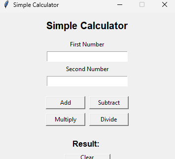
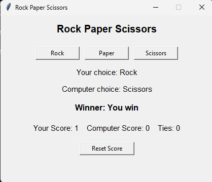
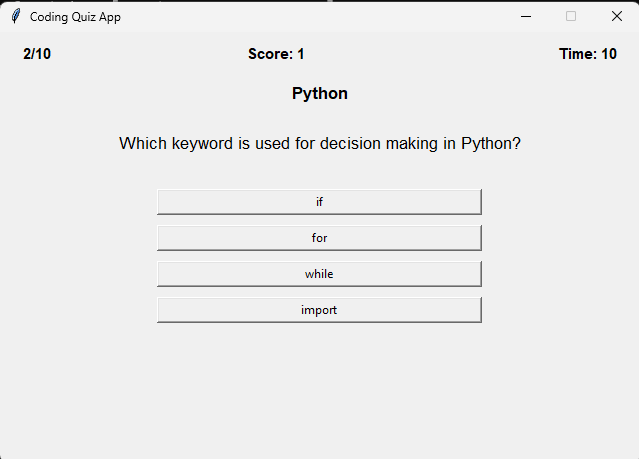

# Beginner Python Projects Collection

A complete beginner-friendly collection of small Python desktop projects. Each project uses a simple Tkinter GUI and can be run independently.

## Projects Included

1. **Number Guessing Game**
   - Guess a random number from 1 to 100.
   - Shows whether the guess is too high, too low, or correct.
   - Tracks attempts and includes a reset button.

2. **Todo List Manager**
   - Add, complete, and delete tasks.
   - Saves tasks automatically in `tasks.json`.
   - Loads saved tasks when the app starts.

3. **Simple Calculator**
   - Performs addition, subtraction, multiplication, and division.
   - Includes input validation and division-by-zero handling.
   - Shows the result clearly in the GUI.

4. **Rock Paper Scissors**
   - Play Rock, Paper, Scissors against the computer.
   - Tracks user score, computer score, and ties.
   - Includes a reset score button.

5. **Coding Quiz App**
   - Beginner-level multiple-choice quiz app.
   - Supports Python, C, C++, Java, JavaScript, and HTML.
   - Uses a JSON question bank and includes a generated PDF with all questions.

## Folder Structure

```text
Number_Guessing_Game/
    number_guessing_game.py

Todo_List_Manager/
    todo_list_manager.py
    tasks.json

Simple_Calculator/
    simple_calculator.py

Rock_Paper_Scissors/
    rock_paper_scissors.py

Coding_Quiz_App/
    coding_quiz_app.py
    questions.json
    questions.pdf
```

## Technologies Used

- Python
- Tkinter
- JSON
- Random
- ReportLab

## How To Run

Make sure Python is installed on your computer. Open a terminal inside the repository folder and run the project you want.

### Number Guessing Game

```bash
cd Number_Guessing_Game
python number_guessing_game.py
```

### Todo List Manager

```bash
cd Todo_List_Manager
python todo_list_manager.py
```

### Simple Calculator

```bash
cd Simple_Calculator
python simple_calculator.py
```

### Rock Paper Scissors

```bash
cd Rock_Paper_Scissors
python rock_paper_scissors.py
```

### Coding Quiz App

```bash
cd Coding_Quiz_App
python coding_quiz_app.py
```

## Coding Quiz App Details

- Multiple language categories: Python, C, C++, Java, JavaScript, and HTML.
- MCQ system with four options per question.
- 15-second timer for each question.
- Random question selection using `random.sample()`.
- Static JSON question bank stored in `questions.json`.
- PDF question file included as `questions.pdf`.

## Screenshots

### Number Guessing Game



### Todo List Manager



### Simple Calculator



### Rock Paper Scissors



### Coding Quiz App



## Future Improvements

- Dark mode
- Better UI styling
- More quiz questions
- Sound effects
- Difficulty levels
- Database support

## Learning Goals

This collection helps beginners practice:

- Python fundamentals
- GUI development with Tkinter
- File handling
- JSON storage
- Problem solving
- Event-driven programming

## Notes

All projects use Python built-in libraries at runtime. The quiz PDF can be regenerated with ReportLab if needed:

```bash
pip install reportlab
```
